# Praktikum Flutter - Layout dan Navigasi

**Nama:** Saria Fauzani  
**NIM:** 2341760178   
**No Absen:** 24

---
## Praktikum 5: Membangun Navigasi di Flutter
**Langkah 1: Siapkan project baru**

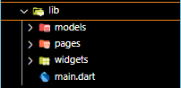

**Langkah 2: Mendefinisikan Route**

- home_page.dart

- item_page.dart

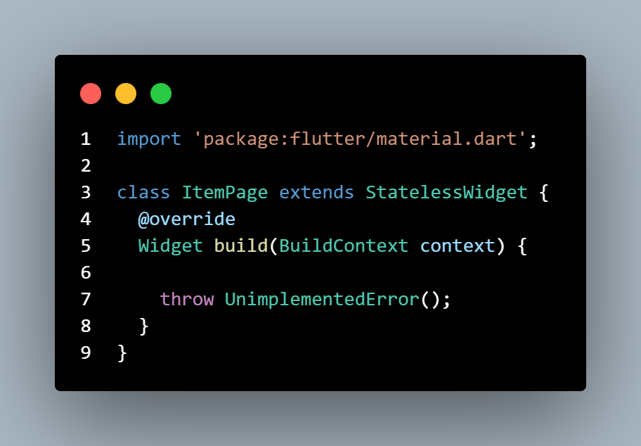

**Langkah 3: Lengkapi Kode di main.dart**

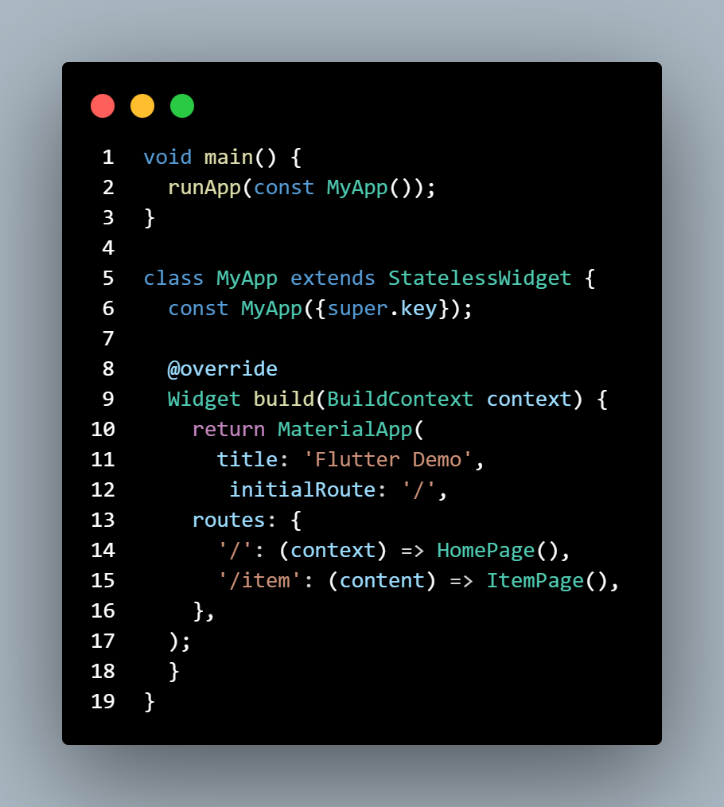

**Langkah 4: Membuat data model**

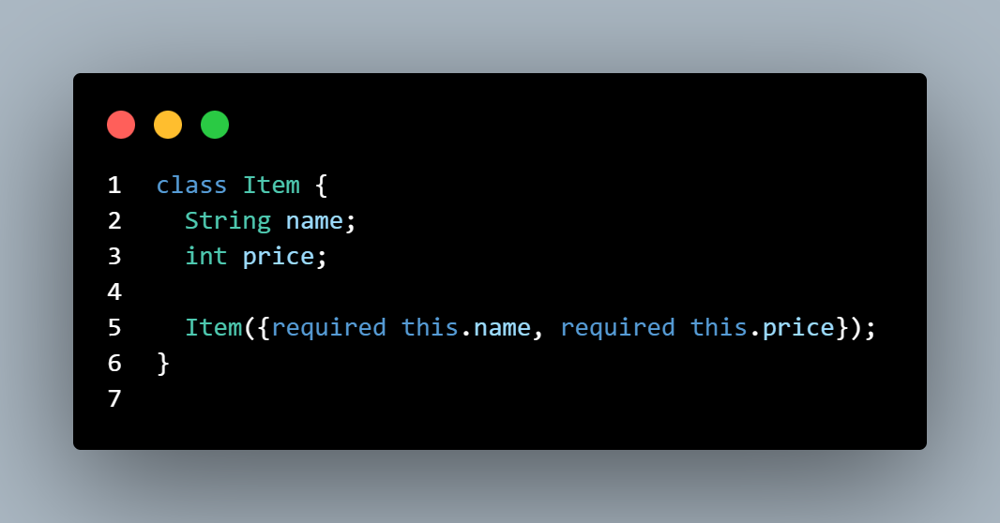

**Langkah 5: Lengkapi kode di class HomePage**

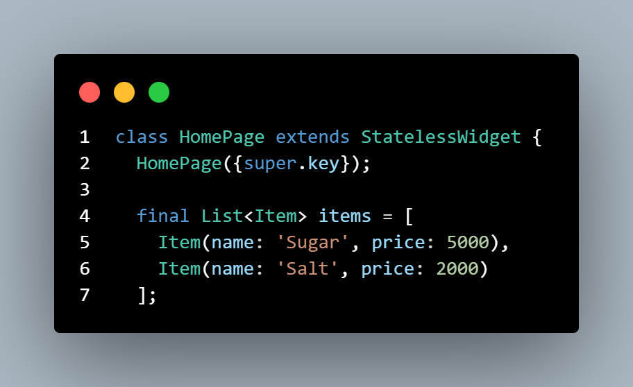

**Langkah 6: Membuat ListView dan itemBuilder**

**Langkah 7: Menambahkan aksi pada ListView**

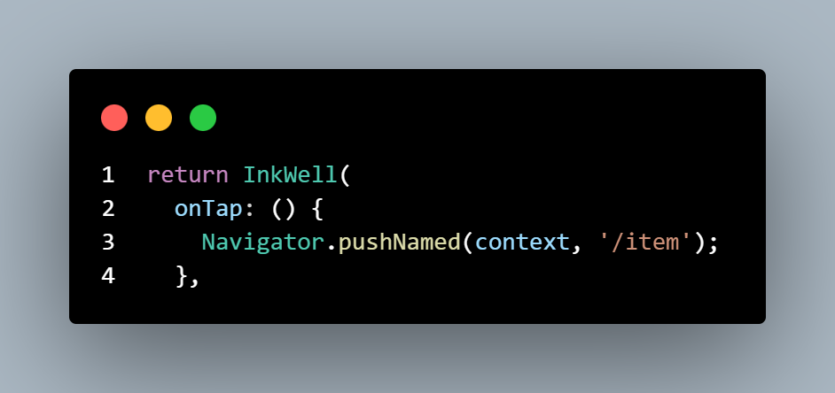

----
***📸Hasil Output***

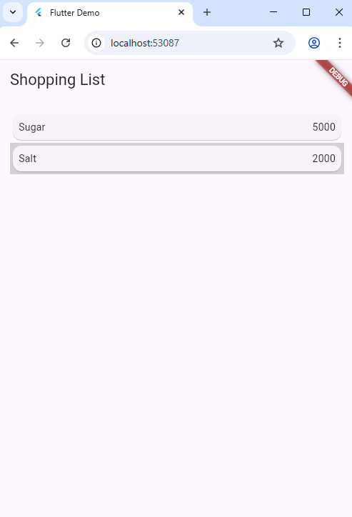

#

## Tugas Praktikum 2
**Tugas 1:** Menambahkan informasi arguments pada penggunaan Navigator

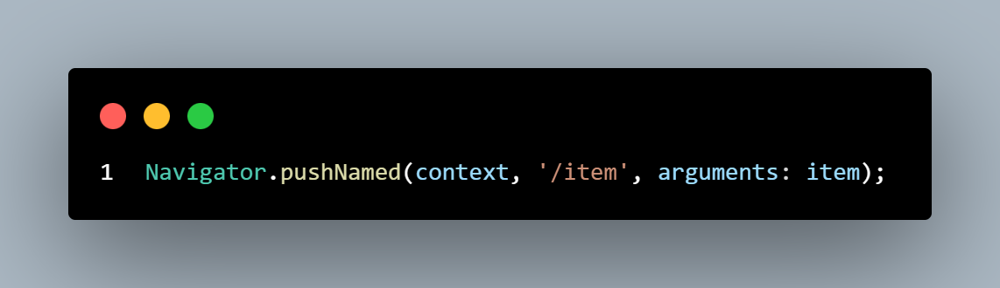

**Tugas 2:** Pembacaan nilai yang dikirimkan pada halaman sebelumnya dapat dilakukan menggunakan ModalRoute.

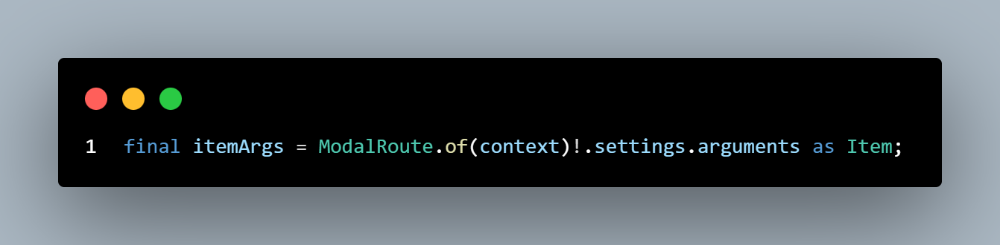

**Tugas 3:** Mengubah tampilan menjadi GridView

- HomePage: ubah dari ListView.builder() menjadi GridView.builder().

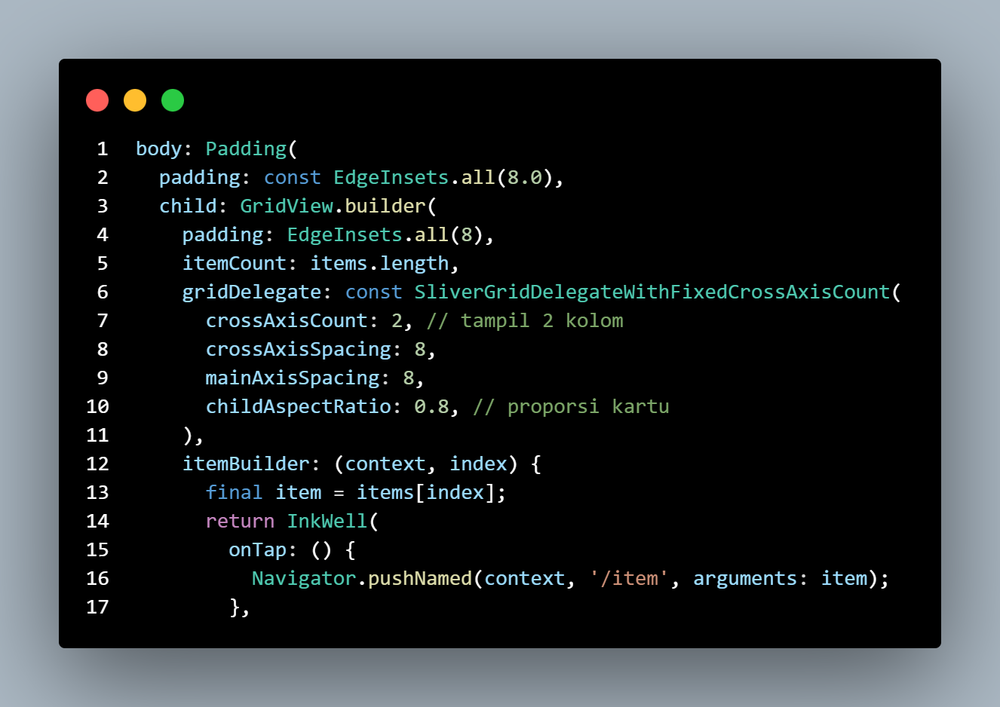

- Model Item: tambahkan atribut baru.

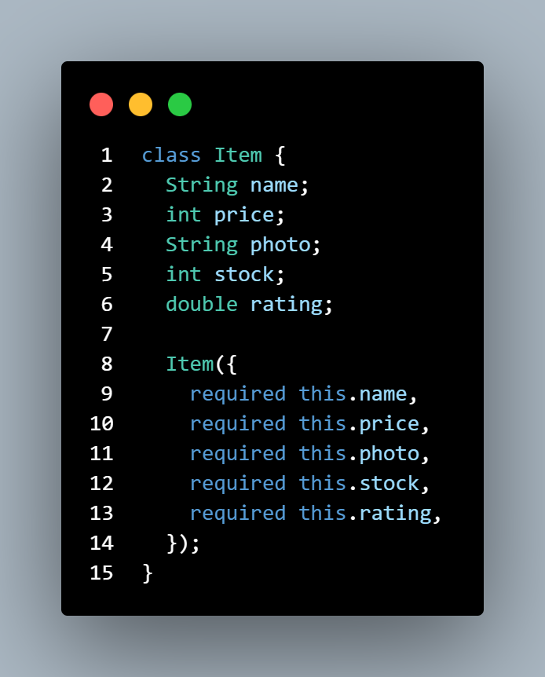

---
***📸Hasil Output***

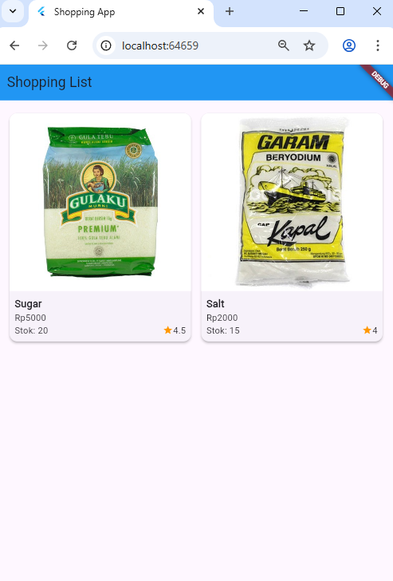

**Tugas 4:** Implementasikan Hero widget

- item_card.dart (Home page):

- item_page.dart (Detail Page):

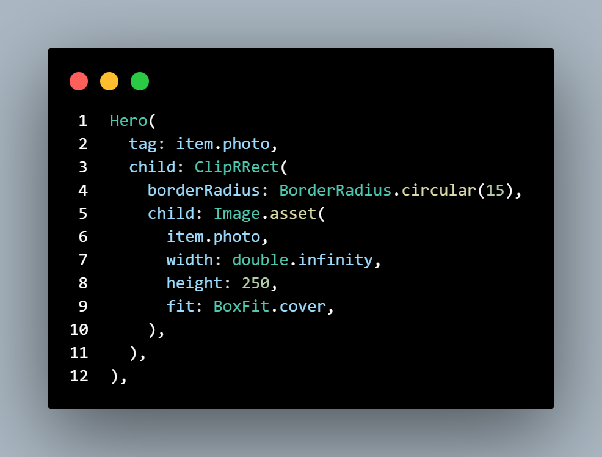

**Tugas 5:** Split Widget menjadi kode yang lebih kecil dan Menambahkan Footer

1. **ItemCard:** Widget untuk tampilan satu produk (gambar, harga, stok, rating) yang digunakan di HomePage.

2. **ItemPage:** Menampilkan detail produk saat salah satu item diklik.

3. **HomePage:** Menampilkan daftar produk menggunakan GridView, dan memanggil ItemCard untuk setiap produk.

4. **Footer:** Widget kecil untuk bagian bawah halaman, menampilkan Nama & NIM.

--- 
Menambahkan Footer

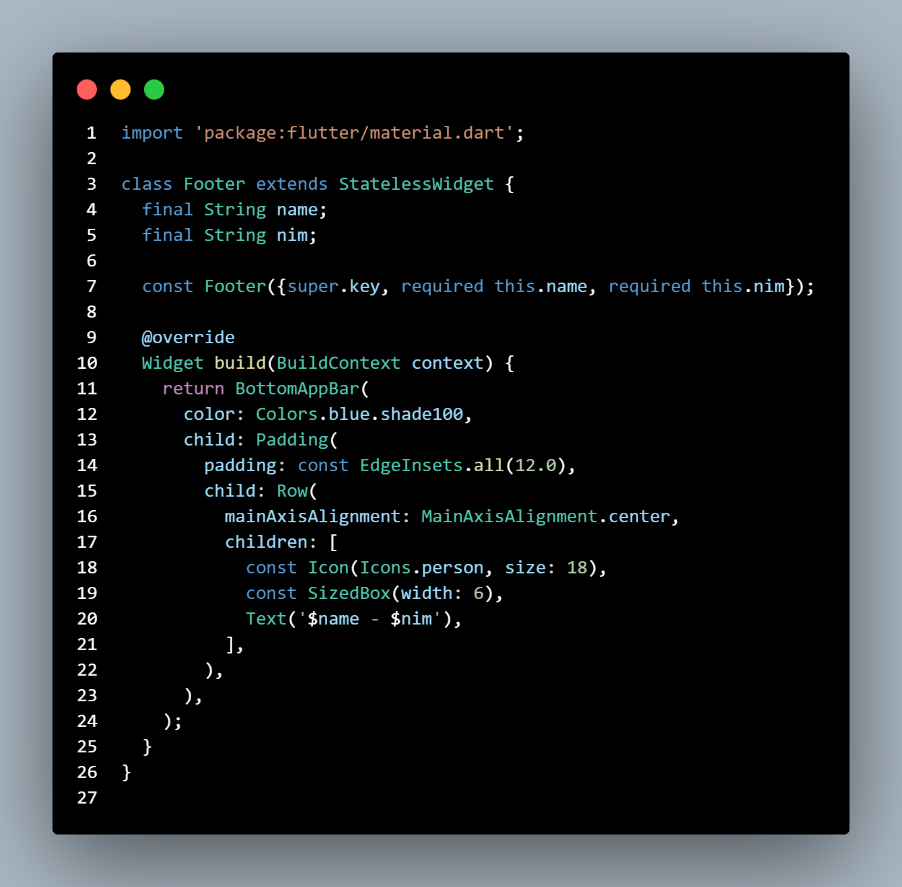

***📸Hasil Output***

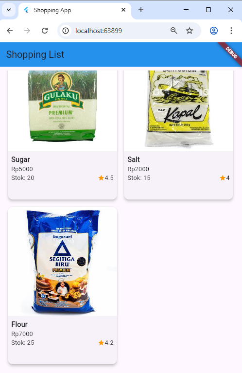

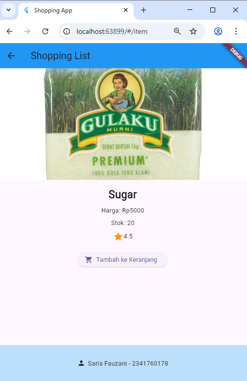

**Tugas 6:** Modifikasi menggunakan plugin go_router

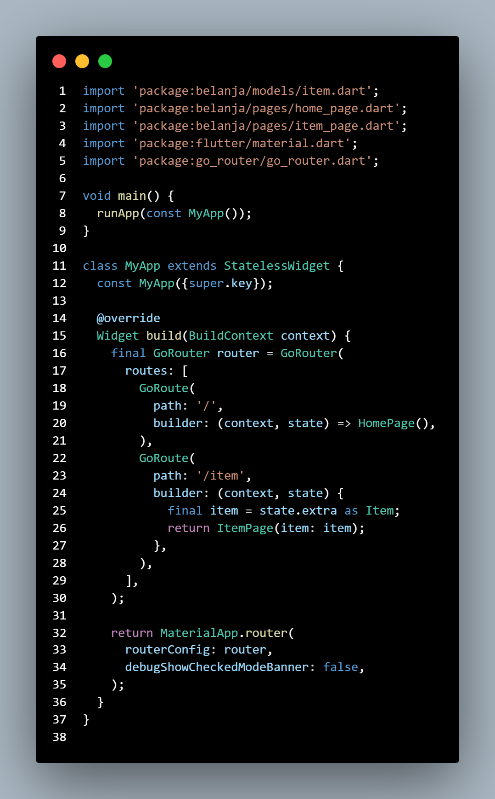

---

***📸Hasil Output***

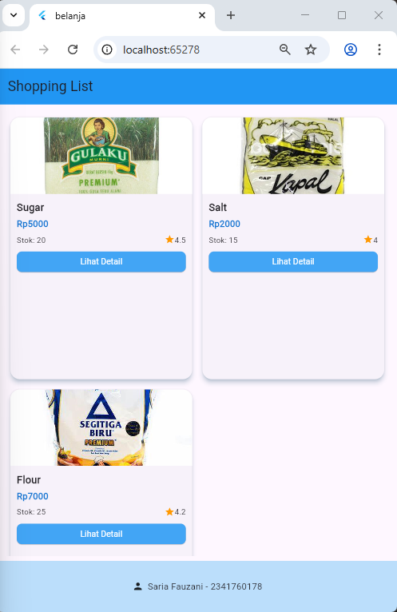
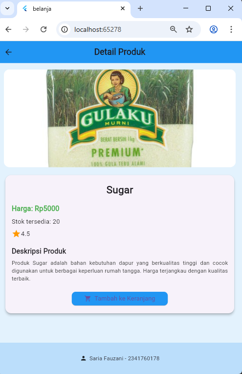
